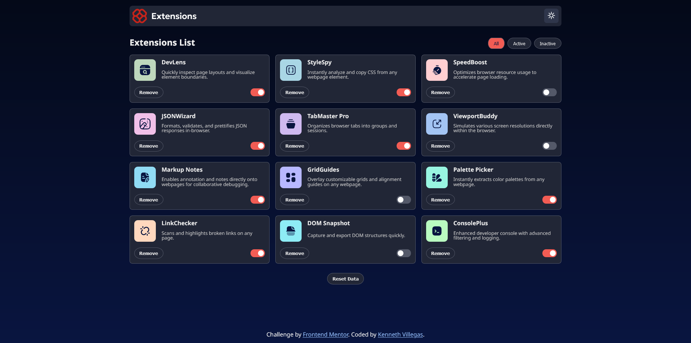

# Frontend Mentor - Browser extensions manager UI solution

This is a solution to the [Browser extensions manager UI challenge on Frontend Mentor](https://www.frontendmentor.io/challenges/browser-extension-manager-ui-yNZnOfsMAp). Frontend Mentor challenges help you improve your coding skills by building realistic projects. 

## Table of contents

- [Overview](#overview)
  - [The challenge](#the-challenge)
  - [Screenshot](#screenshot)
- [My process](#my-process)
  - [Built with](#built-with)
- [Author](#author)

## Overview

### The challenge

Users should be able to:

- Toggle extensions between active and inactive states
- Filter active and inactive extensions
- Remove extensions from the list
- Select their color theme
- View the optimal layout for the interface depending on their device's screen size
- See hover and focus states for all interactive elements on the page

### Screenshot

### Links
- Live Site URL: [Browser extensions manager UI](https://extensions-list-kmv.netlify.app/)

## My process

### Built with

- ReactJS
- Semantic HTML5 markup
- CSS custom properties
- Flexbox
- Google Fonts
- Media Queries

## Author

- Github - [Kenneth Villegas](https://github.com/KmVillegas)
- Frontend Mentor - [@KmVillegas](https://www.frontendmentor.io/profile/KmVillegas)